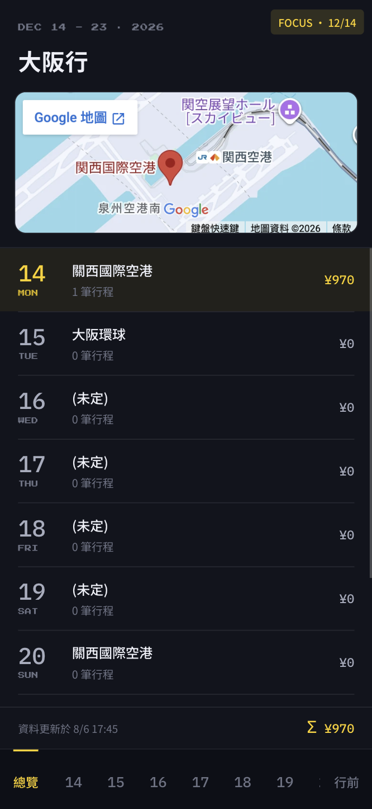
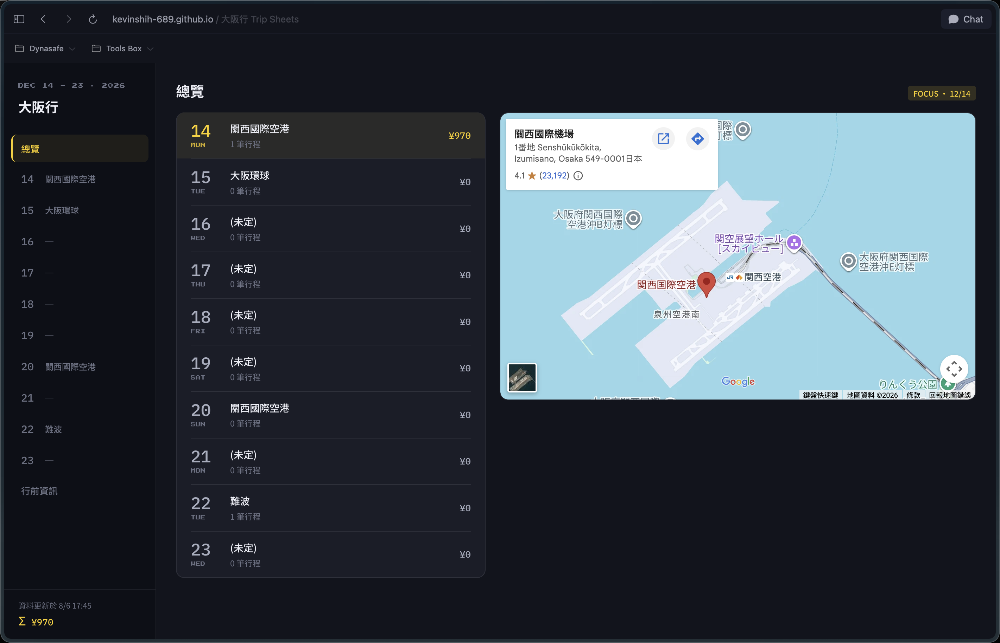
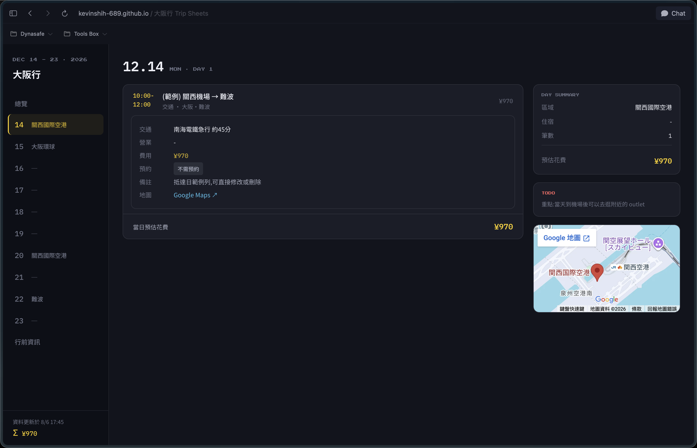
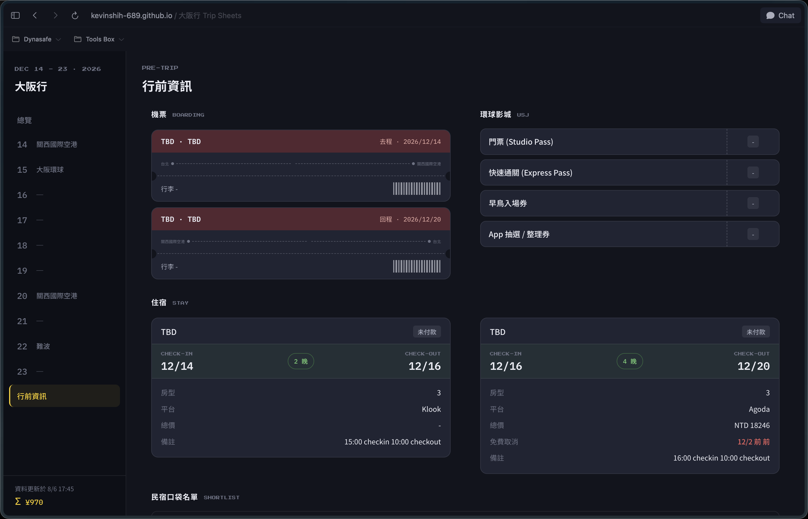
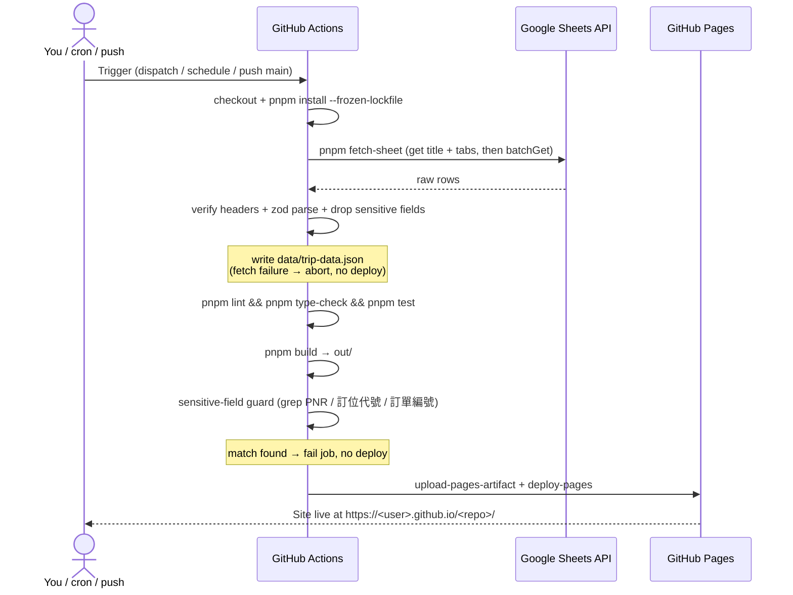

<div align="center">

# Trip Sheets


<br />
<br />

_Built with the tools and technologies:_

<br />


<br />


<br />


</div>

<br />
<br />

> A mobile-first, offline-capable travel itinerary site that treats **Google Sheets as the only source of truth** and ships as a static PWA on GitHub Pages.

Edit your trip in a spreadsheet (from your phone or laptop), push a button, and a fast static website rebuilds itself — no database, no backend, no login. Built for a Japan trip (2026/12/14–12/19), but designed to be reused as a template for any trip.

---

### Mobile

<table align="center">
  <tr>
    <td align="center"></td>
  </tr>
</table>

### Desktop

<table align="center">
  <tr>
    <td align="center"></td>
    <td align="center"></td>
    <td align="center"></td>
  </tr>
</table>

## Features

- **Sheets is the only data store** — no self-hosted DB, no editing UI to build. Edit on the Google Sheets mobile app.
- **Static & fast** — Next.js `output: 'export'`, zero runtime API calls; data is inlined at build time.
- **Mobile-first UI** — bottom tab bar, expandable itinerary cards, per-day cost subtotals, reservation-status highlights, embedded Google Map on the overview page.
- **Retro 8-bit theme** — an original pixel-arcade aesthetic: CSS-drawn question-block empty states, a coin splash animation, and Press Start 2P headings. All artwork is hand-drawn in CSS; no third-party sprite assets.
- **Responsive desktop shell** — single `1024px` breakpoint switches the bottom tab bar to a left sidebar with a large map (CSS-only, no JS breakpoint logic).
- **Offline (PWA)** — service worker precaches every page and asset so the whole site works in airplane mode on the road.
- **Sensitive-field filtering** — PNR and booking reference numbers are dropped at the fetch layer and never enter the static output; CI greps the build to enforce it.
- **Schema-drift protection** — header rows are compared column-by-column on every fetch; a renamed/moved column fails the build instead of silently mis-mapping data.
- **Zero manual file shuffling** — change the sheet, trigger a rebuild from the GitHub mobile app (or wait for the daily cron), and the site reflects it in ~3 minutes.

## Tech Stack

| Layer      | Choice                                           |
| ---------- | ------------------------------------------------ |
| Framework  | Next.js 15 (App Router, `output: 'export'`)      |
| Language   | TypeScript 5.7 (strict), no `any`                |
| UI         | Chakra UI v3 + Emotion 11                        |
| Data fetch | `googleapis` 144 (Sheets API, read-only) + Zod 3 |
| Testing    | Vitest 3 (data-boundary unit tests)              |
| Runtime    | Node 22 (`.nvmrc`), pnpm 9                       |
| CI/CD      | GitHub Actions → GitHub Pages                    |

> Versions track `package.json` — `engines.node` (`>=22`) is the single source of truth for Node; `.nvmrc` and this table follow it.

## Project Structure

```
trip-sheets/
├── .github/
│   ├── workflows/
│   │   ├── ci.yml                 # PR gate: lint → type-check → test → build → guard (no secrets)
│   │   └── deploy.yml             # fetch → lint → type-check → test → build → guard → deploy
│   ├── ISSUE_TEMPLATE/            # bug / feature templates
│   └── PULL_REQUEST_TEMPLATE.md
├── app/                           # App Router pages
│   ├── layout.tsx                 # tab bar / sidebar, PWA meta
│   ├── page.tsx                   # overview: map + day list, auto-focus today
│   ├── day/[date]/page.tsx        # per-day timeline (generateStaticParams ×6)
│   └── backlog/page.tsx           # flights / rooms / USJ / bnb (filtered)
├── components/                    # AppNav, ItineraryCard, MapEmbed, Splash, ...
├── lib/
│   ├── types.ts                   # types (zod z.infer)
│   ├── schema.ts                  # zod schemas
│   ├── parse-sheet.ts             # the single data boundary (pure: parse + validate + filter)
│   ├── parse-sheet.test.ts        # Vitest unit tests for the data boundary
│   ├── theme.ts                   # Chakra custom theme
│   ├── constants.ts               # sheet-structure constants (Backlog tab, layout, weekdays)
│   └── trip-data.ts               # getTripData()
├── scripts/fetch-sheet.ts         # IO + CLI wrapper around lib/parse-sheet.ts
├── data/
│   ├── trip-data.json             # generated by CI (gitignored)
│   └── trip-data.sample.json      # committed sample for local dev
├── public/                        # manifest.json, sw.js, icons
└── next.config.ts
```

---

## Use It as Your Own Trip Tool

This repo is meant to be forked. Here's the end-to-end setup.

### 1. Prepare the Google Sheet

Import [`doc/sheet.xlsx`](doc/sheet.xlsx) into Google Sheets (Google Drive → New → File upload → open with Google Sheets), then edit your trip data in it. The file already has the required layout — a `Backlog` tab plus date tabs with the correct headers and dropdowns — so you just fill in your own itinerary.

**The sheet is the single source of truth for title and dates** (no code edit needed):

- **Trip title** comes from the **spreadsheet name** itself (rename the file in Google Sheets to rename the trip).
- **Dates & number of days** come from the **date tabs that currently exist**. Each date tab is named `M.D (週幾)` (e.g. `12.14 (一)`). Add or remove date tabs and the site renders exactly those days after the next rebuild.
- The eyebrow (`DEC 14 - 19 · 2026`) and splash label are derived automatically from the detected date range.

> Date tabs carry no year — the build infers it from the **weekday** in each tab name. If a tab's weekday doesn't match its date, the build **fails and names the tab** (it never guesses silently). Cross-year trips are not supported.

> Row counts are **not** fixed — the fetch script reads each block until the first fully-blank row, so you can add rows freely. It will error (not silently truncate) if a Backlog table overflows into the next table's header row.

### 2. Google Cloud setup (one-time, ~20 min)

Follow the detailed step-by-step guide in **[`doc/setup-sop.md`](doc/setup-sop.md)**. It covers, with exact console navigation:

- Creating the GCP project and enabling the **Google Sheets API** and **Maps Embed API**
- Creating a **service account** (no GCP roles) and JSON key
- Sharing the spreadsheet with the service account as **Viewer**
- Collecting `SHEET_ID` / `NEXT_PUBLIC_SHEETS_URL`
- Creating and **restricting** the `NEXT_PUBLIC_GMAPS_EMBED_KEY` (HTTP-referrer + API restriction)

The SOP ends by producing the four values you'll paste as GitHub Secrets in step 3.

### 3. Fork this repo & add GitHub Secrets

Repo → **Settings → Secrets and variables → Actions**:

| Secret                        | Value                                                                |
| ----------------------------- | -------------------------------------------------------------------- |
| `GOOGLE_SERVICE_ACCOUNT_KEY`  | The full service-account JSON key                                    |
| `SHEET_ID`                    | The ID between `/d/` and `/edit` in the spreadsheet URL              |
| `NEXT_PUBLIC_GMAPS_EMBED_KEY` | Maps Embed API key (restrict by HTTP referrer to your Pages domain)  |
| `NEXT_PUBLIC_SHEETS_URL`      | Public/edit URL of the sheet, used by the "open Google Sheets" links |

Then set **Settings → Pages → Source = GitHub Actions**.

> ⚠️ The service-account JSON key **must never be committed**. `.gitignore` already blocks `*service-account*.json`, `*sa-key*.json`, `.env*`, and the generated `data/trip-data.json`.

### 4. Adjust the template for your trip

- `next.config.ts` — `basePath` is injected by CI as `/<repo-name>`; nothing to change unless you deploy elsewhere.
- **Title & dates need no code edit** — rename the spreadsheet and add/remove date tabs (see step 1).
- `lib/constants.ts` — only sheet-structure constants remain (the `Backlog` tab name, its fixed layout, the weekday table). Adjust only if you change the sheet's structure.
- Tab labels / branding in `components/` and `lib/theme.ts` as desired.

### 5. Deploy

Push to `main`, or run the **Deploy to GitHub Pages** workflow manually (`workflow_dispatch`) from the Actions tab or the GitHub mobile app. The site publishes to `https://<user>.github.io/<repo>/`.

---

## Prerequisites

- Node 22 — use `nvm use` or `fnm use` to pick it up from `.nvmrc`
- pnpm 9

## Local Development

```bash
pnpm install

# Option A — run against the committed sample data (no GCP needed)
pnpm fetch-sheet:sample     # copies data/trip-data.sample.json → data/trip-data.json
pnpm dev

# Option B — pull live data from your sheet
export GOOGLE_SERVICE_ACCOUNT_KEY="$(cat /path/to/your-sa-key.json)"
export SHEET_ID="your-sheet-id"
pnpm fetch-sheet            # writes data/trip-data.json
pnpm dev
```

Open http://localhost:3000.

### Scripts

| Command                   | Description                                                             |
| ------------------------- | ----------------------------------------------------------------------- |
| `pnpm fetch-sheet`        | Enumerate date tabs + Backlog, validate, filter, write `trip-data.json` |
| `pnpm fetch-sheet:sample` | Use the committed sample data instead of a live sheet                   |
| `pnpm dev`                | Start the Next.js dev server                                            |
| `pnpm build`              | Static export to `out/`                                                 |
| `pnpm lint`               | ESLint (Next config)                                                    |
| `pnpm type-check`         | `tsc --noEmit`                                                          |
| `pnpm test`               | Run Vitest unit tests (data boundary)                                   |
| `pnpm test:watch`         | Vitest in watch mode                                                    |
| `pnpm test:coverage`      | Vitest with a coverage report                                           |

---

## How the Build Pipeline Works

`.github/workflows/deploy.yml` runs on `workflow_dispatch`, a daily cron (`0 21 * * *` UTC = 05:00 Taiwan), and pushes to `main`. Any step failure aborts the deploy — a stale-but-correct site is preferred over a broken one.



`concurrency: { group: pages, cancel-in-progress: true }` means rapid re-triggers only run the latest.

## Security Notes

- The Pages site is **public**, so PNRs and booking reference numbers are removed at the fetch layer — the parser's return types simply don't include those fields, and CI verifies the built output. Look them up in the sheet when needed.
- Service account has **Viewer** access to a single sheet — least privilege, no GCP roles.
- The Maps Embed API key is a public value by design; restrict it by **HTTP referrer** to your Pages domain.

## Known Limitations

- **Not real-time** — changes require a rebuild (manual dispatch or the daily cron). This is the deliberate trade-off for architectural simplicity.
- **Map needs network** — the embedded map won't render offline (a striped placeholder is shown); all other content works offline.
- **Reuse** — swap `SHEET_ID` and the repo name; rename the spreadsheet and set its date tabs. No code edit needed for a new trip; the schema stays the same.

## Documentation

- **[`doc/setup-sop.md`](doc/setup-sop.md)** — step-by-step Google Cloud & API-key setup (referenced by step 2 above).
- **[`doc/sheet.xlsx`](doc/sheet.xlsx)** — the blank spreadsheet template to import into Google Sheets.
- **`data/trip-data.sample.json`** — a committed sample dataset used for local dev and CI (no Google Cloud needed).

## Contributing

Issues and PRs are welcome. See the issue templates and PR checklist under [`.github/`](.github/). In short: use `pnpm fetch-sheet:sample` for local work, make sure `pnpm lint`, `pnpm type-check`, and `pnpm build` pass, and never commit secrets, real PNRs / booking numbers, or personal data.

## License

[MIT](LICENSE) © Kevin Shih

## Disclaimer

This project is **not affiliated with, endorsed by, or associated with Nintendo** or any of its subsidiaries. The retro 8-bit look (question block, coin, pixel headings) is an **original pixel-arcade aesthetic drawn entirely in CSS** — it bundles no Nintendo sprites, artwork, or other assets. The "Press Start 2P" typeface is loaded from Google Fonts and is licensed under the [SIL Open Font License](https://openfontlicense.org/). Any place or attraction names that may appear in sample data are factual references for itinerary purposes only.
